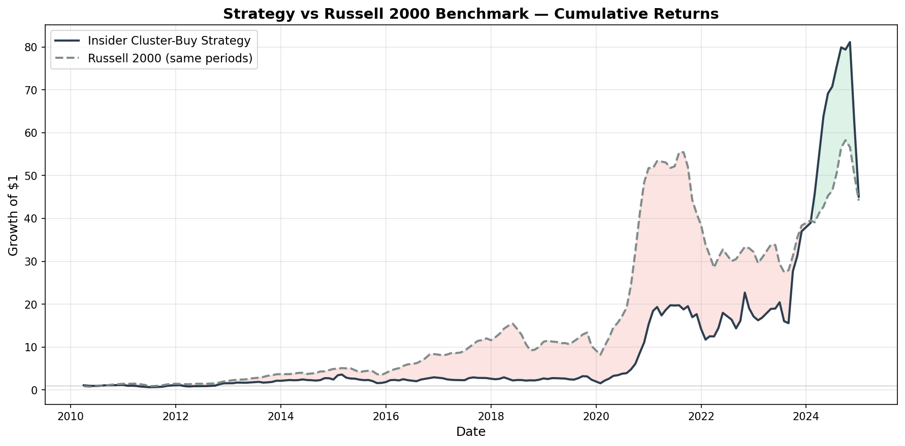
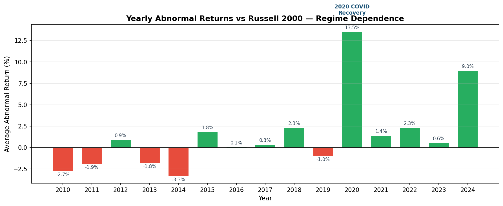

# Testing the Insider Trading Anomaly on Modern Data

A quantitative analysis of SEC Form 4 cluster-buy signals across 15 years of US equity markets (2010–2024).

## Research Question

Academic literature has documented that corporate insider purchases predict positive abnormal stock returns. This project tests whether a simple, publicly implementable insider cluster-buy strategy generates independent alpha on modern data after controlling for known risk factors.

## Key Finding

After controlling for standard risk factors (Fama-French 5-factor model), the strategy's abnormal returns are no longer statistically significant (alpha = 0.08%, t-stat: 0.08). The observed performance is largely explained by market beta (1.28) and small-cap factor exposure (SMB = 1.45) rather than independent alpha.

The signal does produce a 60.7% hit rate and positive raw returns (6.94% per trade over 60 days), but these returns are consistent with what would be expected from holding a leveraged portfolio of small-cap stocks with high market sensitivity. Performance is also heavily regime-dependent, with the 2020 COVID recovery driving the majority of aggregate abnormal returns.

This finding is consistent with recent research indicating that insider trading signals have weakened in modern markets, with much of the informational edge occurring prior to public disclosure and diminishing after filing.





## Methodology

### Data Pipeline
1. **Ingestion** — Downloaded SEC bulk insider transaction datasets (Forms 3, 4, 5) for 2010–2024 from the SEC's structured data repository
2. **Parsing** — Joined SUBMISSION, REPORTINGOWNER, and NONDERIV_TRANS tables on accession number to produce a unified transaction dataset (729,122 raw transactions)
3. **Filtering** — Applied progressive filters to isolate high-conviction purchases:
   - Open market purchases only (transaction code "P")
   - Officers and Directors only (removed 10% owners)
   - Direct holdings only
   - Removed 10b5-1 pre-planned trades
   - $100,000 minimum transaction value
   - Computed conviction metrics (relative position increase)
4. **Signal Generation** — Identified cluster buys: 3+ distinct insiders purchasing within a 30-day window with $500k+ combined value
5. **Backtesting** — Simulated trades entering at next-day open after the filing date, holding for 60 trading days, benchmarked against Russell 2000
6. **Factor Analysis** — Ran Fama-French 5-factor regression to decompose returns into factor exposures and residual alpha

#### Conviction Metric

The relative position increase for each insider purchase is computed as:

$$\text{Relative Increase}_i = \frac{S_i^{\text{bought}}}{S_i^{\text{post}} - S_i^{\text{bought}}}$$

where $S_i^{\text{bought}}$ is the number of shares purchased and $S_i^{\text{post}}$ is the total shares held after the transaction. A higher value indicates stronger personal conviction.

### Backtest Rules
- **Entry**: Opening price on the first trading day after the Form 4 filing date (no look-ahead bias — uses filing date, not transaction date)
- **Exit**: Closing price 60 trading days after entry
- **Benchmark**: Russell 2000 over the identical holding period (selected to match the small/mid-cap profile of the traded universe)
- **Position sizing**: Equal-weighted, trades can overlap, no capital constraints modelled
- **No shorting**: Long-only strategy

### Return Calculations

For each signal, the trade return and abnormal return are computed as:

$$r_{\text{trade}} = \frac{P_{\text{exit}} - P_{\text{entry}}}{P_{\text{entry}}}$$

$$r_{\text{abnormal}} = r_{\text{trade}} - r_{\text{benchmark}}$$

where $P_{\text{entry}}$ is the opening price on the first trading day after the filing date, $P_{\text{exit}}$ is the closing price 60 trading days later, and $r_{\text{benchmark}}$ is the Russell 2000 return over the identical period.

The annualised Sharpe ratio is:

$$\text{Sharpe} = \frac{\bar{r}}{\sigma_r} \times \sqrt{\frac{252}{H}}$$

where $\bar{r}$ is the mean trade return, $\sigma_r$ is the standard deviation, and $H = 60$ is the holding period in trading days.

## Results

### Raw Performance

| Metric | Value |
|---|---|
| Total trades | 1,066 |
| Hit rate | 60.7% |
| Avg return | 6.94% |
| Avg abnormal return (vs Russell 2000) | 2.96% |
| Abnormal return t-stat | 3.46 |
| Sharpe ratio | 0.44 |

Despite positive abnormal returns against the Russell 2000 benchmark, the Sharpe ratio of 0.44 indicates weak risk-adjusted performance that would likely be eroded further by transaction costs in practice.

### Fama-French 5-Factor Regression

| Factor | Coefficient | t-stat | p-value |
|---|---|---|---|
| Alpha | 0.0008 | 0.08 | 0.937 |
| Mkt-RF | 1.2815 | 9.18 | 0.000 *** |
| SMB | 1.4546 | 5.64 | 0.000 *** |
| HML | 0.1464 | 0.81 | 0.416 |
| RMW | 0.3468 | 1.27 | 0.204 |
| CMA | -0.1141 | -0.40 | 0.686 |

The factor-adjusted returns are estimated via OLS regression:

$$r_i - r_f = \alpha + \beta_1 (r_m - r_f) + \beta_2 \cdot \text{SMB} + \beta_3 \cdot \text{HML} + \beta_4 \cdot \text{RMW} + \beta_5 \cdot \text{CMA} + \epsilon_i$$

where $r_i$ is the trade return, $r_f$ is the risk-free rate, and the five factors capture market ($r_m - r_f$), size (SMB), value (HML), profitability (RMW), and investment (CMA) exposures. The intercept $\alpha$ represents return unexplained by factor exposures.

R-squared: 0.273. The strategy's returns are primarily explained by market beta and small-cap exposure. No statistically significant alpha remains after factor adjustment ($\alpha = 0.08\%$, $t = 0.08$).

### Holding Period Sensitivity

| Period | Hit Rate | Avg Return | Avg Abnormal |
|---|---|---|---|
| 20 days | 52.9% | 0.75% | -1.08% |
| 40 days | 53.9% | 2.84% | -0.33% |
| 60 days | 60.7% | 6.94% | 2.96% |
| 90 days | 55.9% | 8.63% | 1.71% |
| 120 days | 57.8% | 10.64% | 1.22% |

*Note: Holding period sensitivity was computed on the full dataset. The 60-day period was selected based on peak abnormal returns against the benchmark. Factor-adjusted alpha is near zero regardless of holding period.*

### Walk-Forward Validation

| Period | Trades | Hit Rate | Avg Abnormal | t-stat |
|---|---|---|---|---|
| Full Sample (2010–2024) | 1,066 | 60.7% | 2.96% | 3.46 |
| In-Sample (2010–2017) | 349 | 60.5% | -0.41% | -0.46 |
| Out-of-Sample (2018–2024) | 717 | 60.8% | 3.72% | 3.00 |
| Out-of-Sample ex-2020 | 565 | 56.5% | 1.21% | 1.56 |
| Full Sample ex-2020 | 914 | 58.0% | 1.21% | 1.56 |

The majority of statistical significance is driven by crisis-period observations, particularly the 2020 COVID recovery. Excluding 2020, abnormal returns are positive but not statistically significant.

### Yearly Breakdown

| Year | Trades | Hit Rate | Avg Return | Avg Abnormal |
|---|---|---|---|---|
| 2010 | 18 | 61.1% | 2.42% | -2.73% |
| 2011 | 50 | 56.0% | 0.93% | -1.90% |
| 2012 | 26 | 73.1% | 6.16% | 0.93% |
| 2013 | 31 | 74.2% | 3.92% | -1.81% |
| 2014 | 36 | 69.4% | 2.14% | -3.33% |
| 2015 | 68 | 44.1% | -2.78% | 1.84% |
| 2016 | 48 | 75.0% | 9.35% | 0.06% |
| 2017 | 72 | 54.2% | 3.50% | 0.35% |
| 2018 | 69 | 56.5% | 1.65% | 2.33% |
| 2019 | 115 | 53.0% | -0.20% | -0.96% |
| 2020 | 152 | 77.0% | 32.41% | 13.54% |
| 2021 | 107 | 54.2% | -1.26% | 1.42% |
| 2022 | 106 | 53.8% | 2.22% | 2.34% |
| 2023 | 85 | 60.0% | 3.70% | 0.57% |
| 2024 | 83 | 63.9% | 12.15% | 9.00% |

## Known Limitations

- **Survivorship bias (Data Access Constraints)**: 44% of tickers from the signal set could not be retrieved from Yahoo Finance (delisted, acquired, or ticker changes). Because institutional-grade, point-in-time price databases are cost-prohibitive for independent research, this project relies on free data. Since missing tickers disproportionately represent distressed or bankrupt companies, the current dataset is artificially inflated. Correcting this bias would likely reduce the raw returns and push the factor-adjusted alpha from zero into negative territory, further reinforcing the conclusion that this anomaly no longer generates an edge.
- **Parameter selection**: The 60-day holding period and filter thresholds were identified on the full dataset. While walk-forward results are presented, true out-of-sample validation would require parameters selected exclusively on historical data.
- **Correlated observations**: Signals cluster during market dislocations (e.g., 50+ signals in Q1 2020). The t-statistic assumes independent observations, which overstates statistical significance during these periods. A more rigorous approach would apply clustered or Newey-West adjusted standard errors.
- **Transaction costs**: Not modelled. Real-world execution would incur bid-ask spreads, particularly in less liquid small-cap names, likely eroding the already marginal pre-factor abnormal returns.
- **Single signal definition**: Only one signal specification was tested (cluster buys). Alternative definitions (e.g., single large purchases, purchases before earnings) may yield different results.

## Project Structure

```
insider-alpha/
├── config.py                    # Signal parameters and settings
├── src/
│   ├── edgar_scraper.py         # Downloads EDGAR master index files
│   ├── bulk_downloader.py       # Downloads SEC bulk insider datasets
│   ├── filing_parser.py         # Joins and filters transaction data
│   ├── signal_generator.py      # Identifies cluster buy signals
│   ├── price_loader.py          # Fetches historical prices via yfinance
│   ├── backtester.py            # Simulates trades and computes metrics
│   └── risk_model.py            # Fama-French 5-factor regression
├── notebooks/
│   └── Research_Tearsheet.ipynb  # Full analysis with visualisations
├── images/                      # Charts for README
│   ├── cumulative_returns.png
│   └── yearly_abnormal_returns.png
└── data/
    ├── raw/                     # SEC bulk data (not committed)
    ├── processed/               # Cleaned datasets and results
    └── factors/                 # Fama-French factor data
```

## Future Work & Institutional Scaling

While this project establishes a baseline framework for parsing and analyzing SEC insider filings, a true production implementation would require upgrading the data stack. If given access to institutional resources, my immediate next steps would include:

1. **Eliminating Survivorship Bias:** Replacing `yfinance` with a point-in-time, delisting-adjusted price database (like CRSP or Norgate Data) to capture the true returns of the 44% of missing tickers. I hypothesize this would result in a lower hit rate and negative alpha, solidifying the paper's core finding.
2. **Transaction Cost Modeling:** Implementing realistic bid-ask spreads and market impact models, particularly for the less-liquid small-cap names that this strategy naturally selects.
3. **Alternative Signal Definitions:** Testing signals that weight purchases relative to the executive's total compensation or total net worth, rather than static dollar amounts.

## Tech Stack

Python, pandas, NumPy, yfinance, statsmodels, matplotlib, SEC EDGAR API

## How to Run

```bash
git clone https://github.com/yourusername/insider-alpha.git
cd insider-alpha
python -m venv .venv
source .venv/bin/activate
pip install -r requirements.txt

# Create .env file with SEC_USER_AGENT="YourName your@email.com"

python src/bulk_downloader.py    # Download SEC data
python src/filing_parser.py      # Parse and join tables
python src/signal_generator.py   # Generate signals
python src/price_loader.py       # Fetch price data
python src/backtester.py         # Run backtest
python src/risk_model.py         # Factor regression
```

## Data Sources

- [SEC Insider Transactions Data Sets](https://www.sec.gov/data-research/sec-markets-data/insider-transactions-data-sets)
- [Yahoo Finance](https://finance.yahoo.com/) (via yfinance)
- [Kenneth French Data Library](https://mba.tuck.dartmouth.edu/pages/faculty/ken.french/data_library.html) (Fama-French factors)
